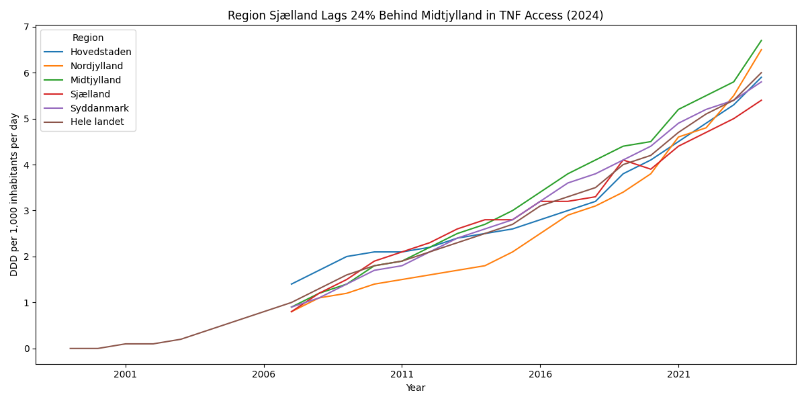
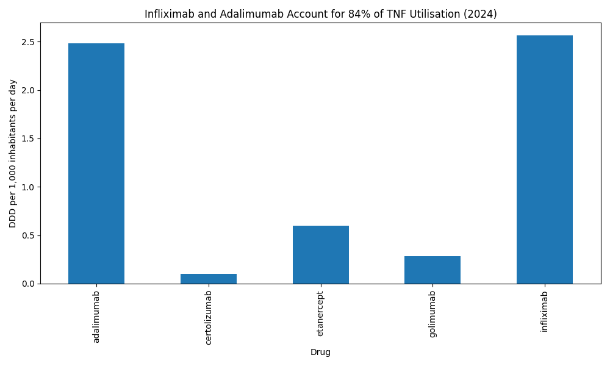
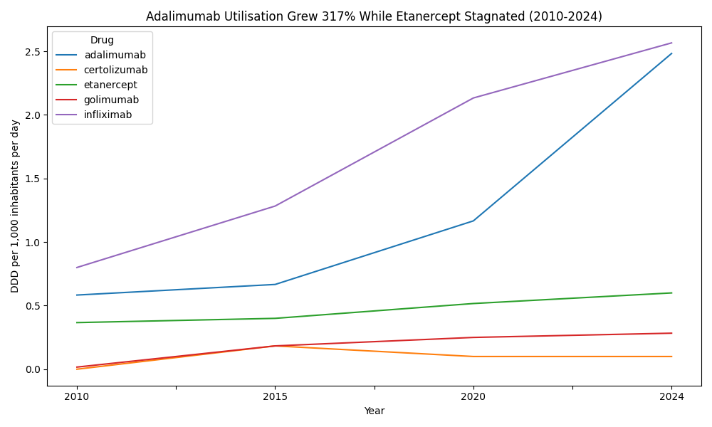
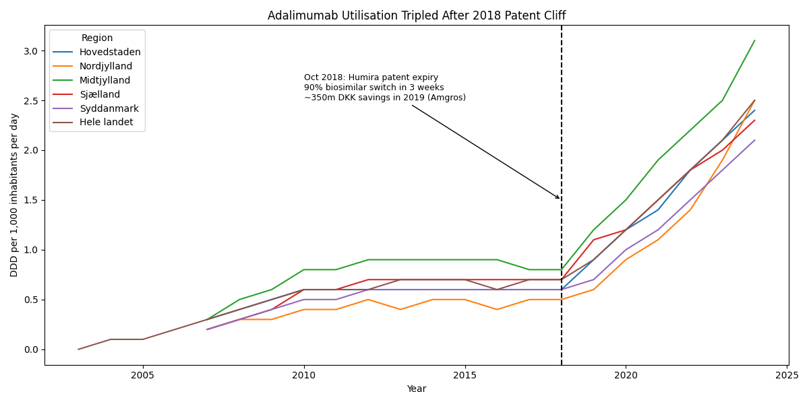

# TNF Inhibitor Access in Denmark: Regional Equity and the 2018 Patent Cliff

## Projektresumé (Dansk)
Analyse af TNF-hæmmer forbrug i de danske regioner 1996-2024. Projektet undersøger regionale uligheder i adgang til biologisk behandling samt effekten af Humiras patentudløb i 2018. Data fra Medstat.dk og Amgros.

---

## Project Overview
This project analyzes TNF inhibitor (biological therapy) utilization across Danish regions from 1996 to 2024, with focus on:
- **Regional equity gaps** in access to biologic therapy
- **Impact of the 2018 Humira patent expiry** on utilization patterns
- **Drug market dynamics** between infliximab, adalimumab, and other TNF inhibitors

## Key Findings

### 1. Regional Disparity
Region Sjælland lags 24% behind Midtjylland in TNF access (5.4 vs 6.7 DDD per 1,000 inhabitants, 2024). This gap is consistent with known specialist shortages in Region Sjælland.

**Policy implication:** If Sjælland matched Midtjylland's utilization, ~398,000 additional DDDs per year would be used, representing ~16 million DKK in additional spending (calculation: ΔDDD × regional population × 40 DKK/DDD biosimilar price from Amgros Q4 2019).

### 2. Market Concentration
Infliximab (43%) and adalimumab (41%) account for 84% of TNF utilization in 2024. Etanercept (10%) has stagnated while golimumab and certolizumab remain niche (<6% combined).

### 3. Patent Cliff Effect
Adalimumab utilization tripled after the October 2018 Humira patent expiry (0.7 → 2.4 DDD nationally, 2018-2024). According to Amgros, Denmark achieved a 90% biosimilar switch within 3 weeks, generating ~350 million DKK in savings in 2019.

## Data Sources

| Source | Description |
|--------|-------------|
| [Medstat.dk](https://medstat.dk) | Danish Medicines Agency drug statistics (ATC: L04AB) |
| [Amgros Markedsovervågning Q4 2019](https://amgros.dk) | Price data, biosimilar market shares |
| Amgros news article | "Ny international rekord i biosimilært skifte" |

## Methodology
- **Metric:** DDD per 1,000 inhabitants per day (WHO standard, population-adjusted)
- **Regions:** Hovedstaden, Nordjylland, Midtjylland, Sjælland, Syddanmark, Hele landet
- **Time period:** 1996–2024
- **Analysis:** Descriptive (no causal claims)

## Limitations
- No line-of-therapy data (cannot determine first-line vs later)
- No diagnosis linkage (cannot attribute to specific diseases)
- No patient-level outcomes
- Regional differences may reflect multiple factors beyond specialist availability

## Technical Skills Demonstrated
- **Data engineering:** Excel ingestion, cleaning Danish-format numbers (decimal comma), handling missing values, combining multiple sources
- **Analysis:** time-series trends, regional comparisons, market share calculations, scenario modeling
- **Visualization:** multi-line charts, bar charts, annotated patent-cliff plot
- **Domain:** TNF inhibitors, biosimilar economics, Danish healthcare system, Amgros/Medstat data

## Visualizations

### Chart 1: Regional Equity Gap


### Chart 2: Drug Market Shares 2024


### Chart 3: Drug Trends Over Time


### Chart 4: Adalimumab Patent Cliff


## Repository Structure
```
├── README.md
├── tnf_analysis.ipynb
├── tnf_combined_clean.csv
├── tnf_by_region.png
├── tnf_by_drug_2024.png
├── tnf_drug_trends.png
├── adalimumab_patent_cliff.png
└── data/
    ├── all_tnf.xlsx
    ├── Etanercept.xlsx
    ├── Infliximab.xlsx
    ├── Adalimumab.xlsx
    ├── Certolizumab pegol.xlsx
    └── Golimumab.xlsx
```

## How to Run
1. Clone the repository
2. Install dependencies: `pip install pandas matplotlib openpyxl`
3. Open `tnf_analysis.ipynb` in VS Code or Jupyter
4. Run all cells

**Requirements:** Python 3.10+

## Future Extensions
With access to additional data, this analysis could be extended to:
- Link to RKKP/DANBIO patient outcomes
- Analyze waiting times for biologic initiation
- Compare cost-effectiveness across regions
- Model impact of future biosimilar entries

## Author
**Anoosh Asadi**  
Medical Doctor | Healthcare Data Analyst  
Copenhagen, Denmark  
[LinkedIn](https://www.linkedin.com/in/anooshasadi) | [Email](mailto:anooshasadi@gmail.com)

---
*This project demonstrates the intersection of clinical knowledge and data analysis skills, aimed at healthcare analytics roles in the Danish pharmaceutical and hospital sector.*
